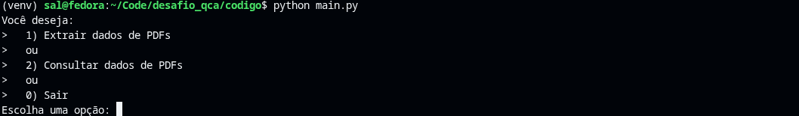

# Desafio Técnico QCA


## Automação Python de Leitura e Consulta de PDFs

### Construir uma Automação extraia dados de um PDF e retorne um “database.json”

> Extrair dados de um PDF e processar faturas do setor financeiro de uma empresa.

### Foto do Programa:



## Instruções de Instalação

*Como foi pedida uma versão do python inferior à atual, seguem os passos para instalação em qualquer máquina Windows e Linux* <br><br>
*Se não deseja instalar a versão 3.13 do python, pode usar usar a mais atual, pulando a instalação do pyenv e somente crie o venv como abaixo, ative-o e instale as dependências com o requirements*

```powershell
# Como instalar no Windows
# No Windows o processo é mais fácil

# Instale o Pyenv, caso não tenha a versão do python antiga
# Em um Powershell como administrador, rode em sequência esse comando
Set-ExecutionPolicy -ExecutionPolicy RemoteSigned -Scope LocalMachine

# e esse
Invoke-WebRequest -UseBasicParsing -Uri "https://raw.githubusercontent.com/pyenv-win/pyenv-win/master/pyenv-win/install-pyenv-win.ps1" -OutFile "./install-pyenv-win.ps1"; &"./install-pyenv-win.ps1"

# Pyenv agora foi instalado, agora reinicie o Powershell do windows (não precisa do administrador)
# Instale o python desejado 
pyenv install 3.13.11

# Clone o projeto
git clone https://github.com/sal0minh0/desafio_tecnico_qca.git

# Crie o venv para o projeto, já com o terminal na pasta do projeto
python -m venv venv

# Para usar o venv no windows
venv\Scripts\Activate.ps1

# Use essa versão python
pyenv global 3.13.11

# Verificar se está na versão correta
python --version

# Para instalar as dependencias do projeto, já no venv rode: (no Windows e Linux)
pip install -r requirements.txt
``` 

```bash
# Para o usar o python 3.13 no Linux projeto siga o tutorial:
# Garanta a instalação das dependencias
sudo apt update
sudo apt install -y \
  build-essential \
  libssl-dev \
  zlib1g-dev \
  libbz2-dev \
  libffi-dev \
  libreadline-dev \
  libsqlite3-dev \
  liblzma-dev \
  libncurses-dev \
  tk-dev \
  curl \
  git

# Instale o pyenv
curl https://pyenv.run | bash

# Edite o Bashrc
nano ~/.bashrc

# com essas linhas:
export PYENV_ROOT="$HOME/.pyenv"
export PATH="$PYENV_ROOT/bin:$PATH"
eval "$(pyenv init -)"

# Reinicie o terminal e depois instale a versão do python 3.13
pyenv install 3.13.11

# Use a versão
pyenv local 3.13.11

# Clone o projeto
git clone https://github.com/sal0minh0/desafio_tecnico_qca.git

# Crie um venv com esse Python, já na pasta do projeto
python -m venv venv

# Use o venv
source venv/bin/activate

# Verifique se o python está na versão desejada
which python
python --version

# Para instalar as dependencias do projeto, já no venv rode: (no Windows e Linux)
pip install -r requirements.txt
```

### Para o rodar o programa, já com o venv ativado e as dependências instaladas:

```
python main.py
```
